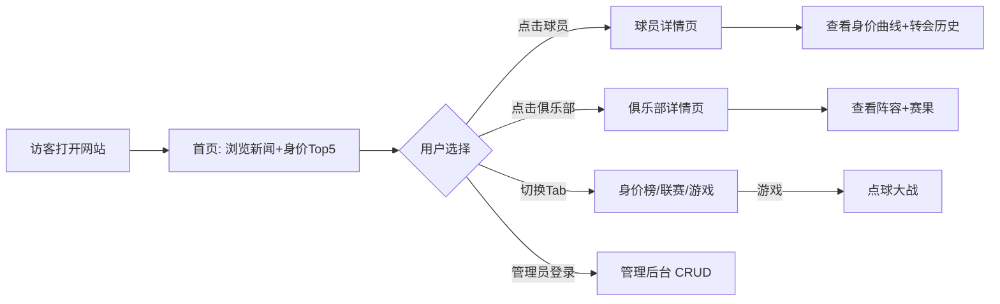

# 德转风暴 - 足球转会市场网站 PRD

## 1. 产品概述
"德转风暴"是一个仿 Transfermarkt（德国转会市场）的足球转会信息聚合网站，提供球员身价榜、转会动态、俱乐部/球员档案、联赛积分榜与一个趣味足球小游戏。面向足球爱好者，让他们在一个页面内快速浏览全球转会市场动态。

- 解决问题：聚合分散的转会新闻、球员身价、联赛数据，单页式快速浏览。
- 目标用户：足球球迷、转会市场关注者、FM（足球经理）游戏玩家。

## 2. 核心功能

### 2.1 用户角色
| 角色 | 注册方式 | 核心权限 |
|------|---------|---------|
| 游客 | 无需注册 | 浏览所有公开页面、玩小游戏 |
| 管理员 | 固定密码（admin/1234） | 增删改球员/俱乐部/新闻、重置数据 |

### 2.2 功能模块
1. **首页**：Hero 区 + 顶级转会新闻流 + 身价 Top 5 球员快览 + 联赛速览
2. **身价榜页**：可搜索、按位置/俱乐部/国籍筛选的球员身价排行榜
3. **球员/俱乐部详情页**：档案、身价曲线、转会历史、相关新闻
4. **联赛页**：积分榜 + 近期赛果 + 射手榜
5. **小游戏页**：点球大战小游戏（射门/扑救）
6. **管理后台**：CRUD 球员、俱乐部、新闻；localStorage 持久化

### 2.3 页面详情
| 页面 | 模块 | 功能说明 |
|------|------|---------|
| 首页 | Hero 横幅 | 渐变背景 + 大标题 + 实时滚动新闻条 |
| 首页 | 热门转会卡片 | 最新 6 条转会新闻卡片，含球员头像、转会费、出处俱乐部徽章 |
| 首页 | 身价 Top 5 | 横向滚动卡片，展示身价最高的 5 名球员 |
| 身价榜 | 搜索筛选栏 | 关键词搜索、位置/俱乐部下拉、身价范围滑块 |
| 身价榜 | 排行表格 | 排名、头像、姓名、位置、俱乐部、年龄、身价（带涨跌色） |
| 球员详情 | 头部卡片 | 头像、基本信息、当前身价、市场涨跌 |
| 球员详情 | 身价曲线 | SVG 折线图展示历史身价变化 |
| 球员详情 | 转会历史 | 时间轴列表，含转入/转出俱乐部、转会费、日期 |
| 俱乐部详情 | 阵容表 | 按位置分组显示球员，含身价、号码 |
| 俱乐部详情 | 最近赛果 | 最近 5 场比赛结果卡片 |
| 联赛页 | 积分榜 | 排名、队名、场次、胜平负、积分，前 4 名突出色 |
| 联赛页 | 射手榜 | Top 10 射手，含进球数、俱乐部 |
| 小游戏 | 点球大战 | Canvas 游戏：选择角度射门 vs AI 守门员扑救 |
| 管理后台 | 数据管理 | Tab 切换：球员 / 俱乐部 / 新闻 CRUD 表单 |

## 3. 核心流程

主要用户流程：访客打开首页 → 浏览转会新闻 → 点击新闻/球员跳转详情 → 切换联赛页查看积分 → 玩小游戏放松。

## 4. 用户界面设计

### 4.1 设计风格
- **主题**：暗色主导（深炭灰 #0E1116 底）+ 翠绿主色（#22C55E，呼应球场草坪）+ 警示橙（#F97316，转会费/涨跌）
- **配色**：主色 #22C55E、辅色 #F97316、危险色 #EF4444、信息蓝 #38BDF8、中性灰阶
- **按钮**：圆角 8px、3D 微凸起、悬停发光
- **字体**：标题用 Bebas Neue / Oswald（运动感无衬线），正文用 Noto Sans SC
- **布局**：顶部固定导航 + 12 栅格卡片布局 + 大量留白与卡片阴影
- **图标**：使用 emoji 与 SVG 内联图标，避免外部依赖

### 4.2 页面设计概览
| 页面 | 模块 | UI 元素 |
|------|------|---------|
| 首页 | Hero | 深绿渐变背景、白色巨型标题、底部滚动新闻条 marquee |
| 身价榜 | 表格 | 暗色卡片表、悬停高亮行、身价涨跌绿/红圆点 |
| 球员详情 | 头部 | 圆形头像、左侧身价大数字、右侧曲线图 |
| 联赛页 | 积分榜 | 前 4 名绿色边框（欧冠区）、降级区红色边框 |
| 小游戏 | 球场 | Canvas 球门 + 足球 + 角度选择条 + 比分板 |
| 管理后台 | 表单 | 左侧 Tab 导航、右侧表单、表格行内编辑按钮 |

### 4.3 响应式
桌面优先（≥1024px），平板自适应（768-1024px 折叠侧栏），移动端（<768px）单列堆叠 + 汉堡菜单。

### 4.4 主题切换
顶部右上角按钮切换明/暗主题，使用 CSS 变量 + localStorage 记忆偏好。暗色为默认，明色采用米白底 + 深绿点缀。
