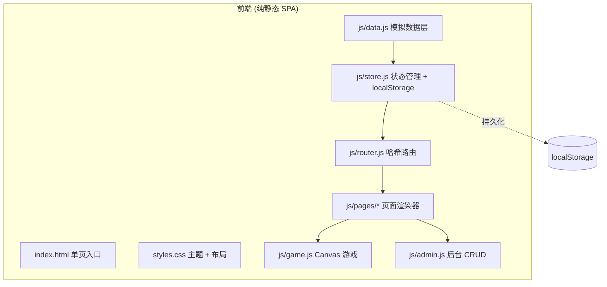
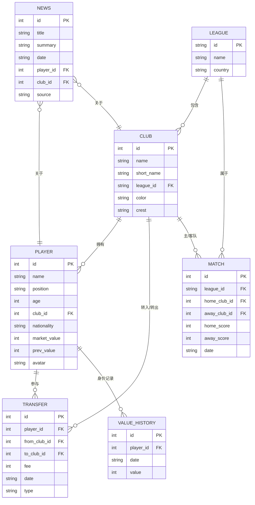

# 德转风暴 - 技术架构文档

## 1. 架构设计

## 2. 技术说明
- **前端**：纯 HTML5 + 原生 CSS3 + 原生 ES6+ JavaScript（无框架、无构建步骤）
- **初始化工具**：手写文件结构，直接打开 index.html 即可运行
- **后端**：无（前端 mock 数据 + localStorage 持久化）
- **数据来源**：js/data.js 内置模拟数据（球员、俱乐部、联赛、新闻）
- **存储**：localStorage（用户偏好、管理员编辑的数据覆盖）

## 3. 路由定义（hash 路由）
| 路由 | 用途 |
|------|------|
| `#/` | 首页：Hero + 新闻流 + 身价 Top 5 |
| `#/rankings` | 身价榜：可搜索筛选的球员排行榜 |
| `#/player/:id` | 球员详情：身价曲线 + 转会历史 |
| `#/club/:id` | 俱乐部详情：阵容 + 赛果 |
| `#/league/:id` | 联赛页：积分榜 + 射手榜 |
| `#/game` | 点球大战小游戏 |
| `#/admin` | 管理后台（需登录） |

## 4. 数据模型

### 4.1 数据模型定义

### 4.2 数据初始化
- `js/data.js` 导出 `PLAYERS / CLUBS / LEAGUES / TRANSFERS / MATCHES / NEWS / VALUE_HISTORY` 数组
- 包含 5 大联赛（英超、西甲、意甲、德甲、法甲）共 ~20 支代表俱乐部
- ~40 名知名球员（哈兰德、姆巴佩、贝林厄姆、维尼修斯、萨卡等）
- ~30 条转会新闻（2024-2025 夏窗真实/拟真动态）

## 5. 关键模块设计

### 5.1 状态管理 (store.js)
- 单一全局 `state` 对象：`{ players, clubs, leagues, transfers, matches, news, theme, adminLoggedIn }`
- `loadState()`: 从 localStorage 读取覆盖数据；`saveState()`: 持久化
- 提供 `subscribe(fn)` 订阅状态变化触发重渲染

### 5.2 路由 (router.js)
- 监听 `hashchange`，解析 `#/player/12` 形式
- 注册路由表 → 渲染对应 page 函数到 `#app` 容器
- 顶部导航 active 高亮

### 5.3 主题切换
- CSS 变量定义 `--bg, --fg, --accent` 等
- `<html data-theme="dark|light">` 切换
- localStorage 记忆

### 5.4 点球大战游戏 (game.js)
- Canvas 800×500 球门视角
- 玩家点击/键盘选择射门角度（左/中/右）与力度
- AI 守门员随机扑救方向，30% 概率扑出
- 5 轮制 + 突然死亡，实时比分板
- 进球动画：足球飞向球门 + 网晃动效果
